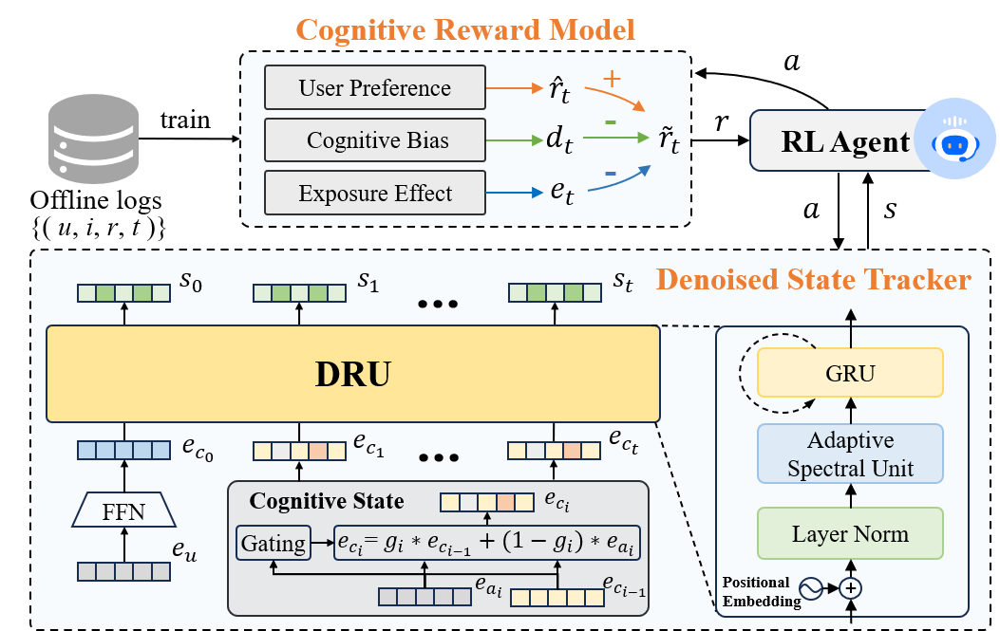

# CDIVR: Cognitive Dissonance-aware Interactive Video Recommendation

This repository contains the official Pytorch implementation for the paper *CDIVR: Cognitive Dissonance-aware Interactive Video Recommendation (DASFAA 2025)*.



---
## Installation

1. Clone this git repository and change the directory to this repository:

	```bash
	git clone git@github.com:sana-mine/CDIVR-codes.git
	cd CDIVR-codes
	```

2. A new [conda environment](https://docs.conda.io/projects/conda/en/latest/user-guide/concepts/environments.html) is suggested. 

    ```bash
    conda create --name CDIVR python=3.10 -y
    ```

3. Activate the newly created environment.

    ```bash
    conda activate CDIVR
    ```

4. Install the required 

    ```bash
    sh install.sh
    ```

Note that the implementation requires two platforms, [DeepCTR-Torch](https://github.com/shenweichen/DeepCTR-Torch) and [Tianshou](https://github.com/thu-ml/tianshou). The codes of the two platforms have already been included in this repository and are altered here and there. 

## Download the data

1. Download the compressed dataset

    ```bash 
    wget https://zenodo.org/records/10448452/files/"environment data.zip" # (md5:bb165aac072e00e5408ac5c159f38c1f)
    wget https://nas.chongminggao.top:4430/DORL/environments.tar.gz
    ```

2. Uncompress the downloaded `environments.tar.gz` and put the files to their corresponding positions.

   ```bash
   unzip "environment data.zip"
   tar -zxvf environments.tar.gz
   ```

If things go well, you can run the following examples now.

---
## Examples to run the code

The following commands only give one argument `--cuda 0` as an example. For more arguments, please kindly refer to the paper and the definitions in the code files. 

- #### KuaiRand

1. Train the Cognitive Reward Model on historical logs

    ```bash
    python3 CDIVR-RZModel-kuaiRand.py --cuda 0
    ```

2. Plan the RL policy using a trained user model

    ```bash
    python3 CDIVR-RL-kuaiRand.py --cuda 0 --epoch 100 --message "CDIVR"
    ```

---

- #### KuaishouEnv

1. Train the Cognitive Reward Model on historical logs

    ```bash
    python3 CDIVR-RZModel-kuaishou.py --cuda 0
    ```

2. Plan the RL policy using trained user model

    ```bash
    python3 CDIVR-RL-kuaishou.py --cuda 0 --epoch 100 --message "CDIVR"
    ```

---
## Acknowledgement
The structure of this code is based on [CIRS](https://github.com/chongminggao/CIRS-codes) and [DORL](https://github.com/chongminggao/DORL-codes). Thank for their excellent work.